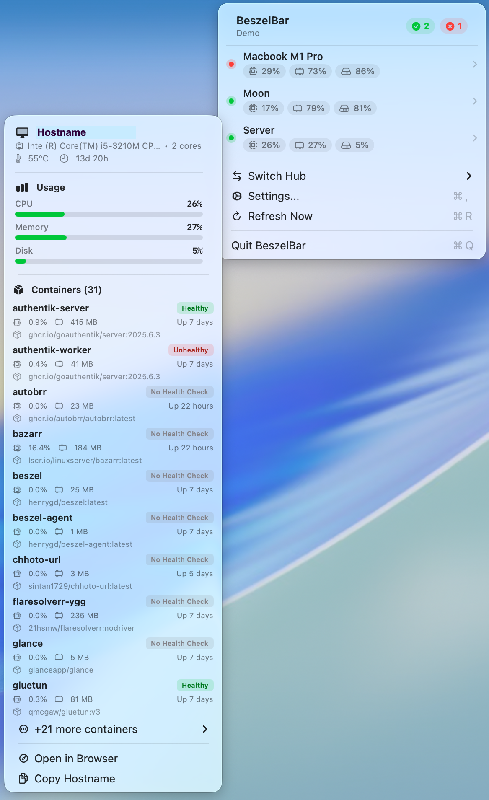

# BeszelBar

**Your Beszel servers at a glance from the menu bar.**

BeszelBar keeps your [Beszel](https://github.com/henrygd/beszel) infrastructure in view without opening a browser. Connect to your hubs and get a clear, glanceable dashboard for system health, resource usage, containers, and alerts right from the macOS menu bar.

## Installation

### Download

Download the latest release from the [Releases](https://github.com/Loriage/BeszelBar/releases) page.

### Build from source

```bash
# Requires Xcode 15+ and xcodegen
brew install xcodegen
git clone https://github.com/Loriage/BeszelBar.git
cd BeszelBar
./build.sh
open build/Release/BeszelBar.app
```

## Screenshot



## Features

- **Live system cards** — See all your servers with status indicators, CPU, memory, and disk at a glance
- **Rich system details** — Hover for detailed metrics including temperature, uptime, and usage bars
- **Container monitoring** — View Docker containers with health status, resource usage, and image info
- **Alert notifications** — Active alerts displayed prominently with triggering conditions
- **Multi-hub support** — Connect multiple Beszel instances and switch between them instantly
- **Native performance** — Built with SwiftUI and AppKit for minimal resource usage
- **Secure authentication** — Credentials stored safely in macOS Keychain
- **Auto-refresh** — Configurable polling interval from 10 seconds to 5 minutes

## Setup

1. Launch BeszelBar
2. Click the menu bar icon and open **Settings**
3. Add your Beszel hub URL, email, and password
4. Your servers will appear in the menu bar dropdown

BeszelBar supports both password and JWT token authentication. Tokens are automatically refreshed when needed.

## Requirements

- macOS 14.0 (Sonoma) or later
- A running [Beszel](https://github.com/henrygd/beszel) hub instance

## License

MIT License — see [LICENSE](LICENSE) for details.

## Acknowledgments

- [Beszel](https://github.com/henrygd/beszel) — Lightweight server monitoring hub
